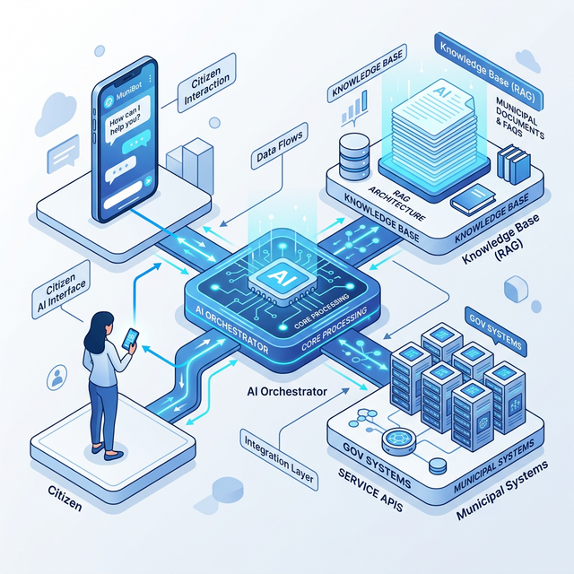

# System Architecture Overview

  
  
<em>System Architecture Concept</em>

This directory contains the conceptual and technical blueprints for the MentorIA GovDesk system.

The platform is designed to be highly modular, separating the conversational AI layer from the knowledge retrieval and backend orchestration systems. This ensures scalability, security, and the ability to integrate with diverse municipal IT environments.

## Core Layers

1.  **AI Assistant Layer:** The conversational interface where citizens interact via natural language. E.g., web portals, WhatsApp, or mobile app integrations.
2.  **RAG Knowledge System:** The retrieval engine that grounds the AI's responses in official, up-to-date government documentation.
3.  **Agent Orchestration Layer:** The workflow engine that translates citizen intent into actionable administrative steps (routing, ticket creation, validation).
4.  **Analytics Engine:** The monitoring system that tracks demand, identifies bottlenecks, and provides insights for process improvement.

Consult the specific files in this directory for detailed breakdowns of these components.

---
**[⬅️ Back to README](../README.md)** | **[Next: AI Agent Layer ➡️](ai_agent_layer.md)**
