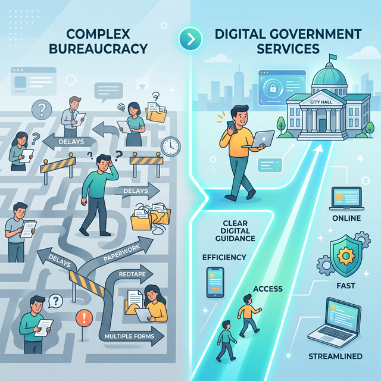

# Public Value & Citizen Impact

  
  
<em>Citizen Impact Concept</em>

MentorIA GovDesk is fundamentally designed to generate public value. While the technology is advanced, the core metrics of success for this project are measured in human impact.

## 1. Democratizing Access to Services
Navigating municipal regulations often requires specialized knowledge or the time to queue in government offices. MentorIA acts as an equalizer, allowing any citizen to interact with the government using natural language, regardless of their legal or technical literacy.

## 2. Reducing Administrative Friction ("Time Taxes")
The "time tax" refers to the hidden costs citizens pay in time and frustration when dealing with bureaucracy. 
By orchestrating workflows (like ticket generation and form validation) instantly via chat, the platform drastically cuts down the hours citizens spend trying to access services to which they are entitled.

## 3. Benefits to Municipalities
- **Increased Capacity:** Routine inquiries are handled by the AI, freeing up human civil servants to handle complex cases that require empathy and human judgment.
- **Process Optimization:** Analytics from the agent layer highlight exactly where citizens get stuck in existing procedures, providing data-driven insights for structural reform.
- **Improved Trust:** Fast, accurate, and predictable government responses foster greater trust in local institutions.

---
**[⬅️ Back to README](../README.md)** | **[Next: Scalability ➡️](scalability.md)**
